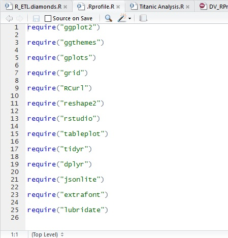
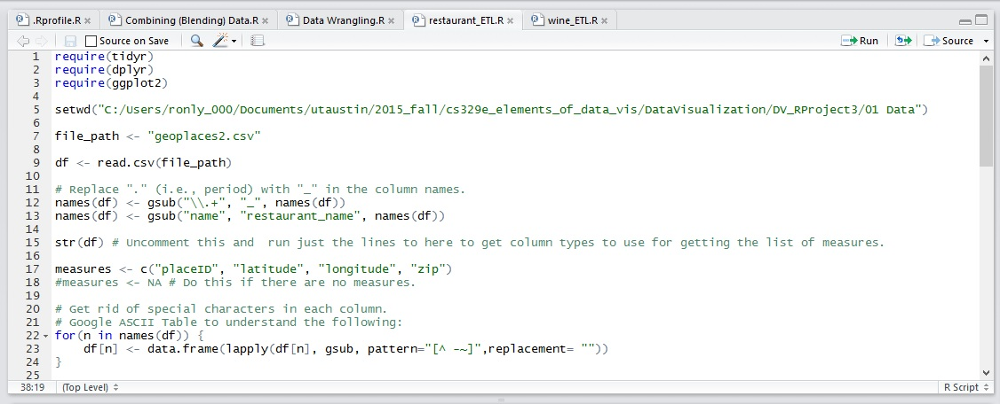
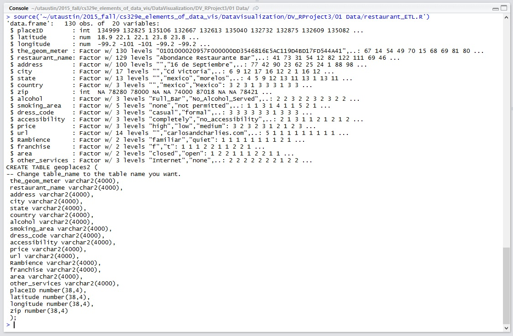
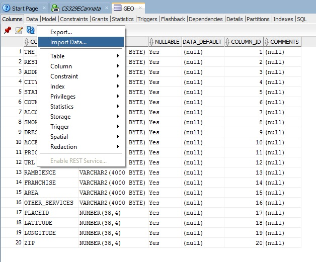
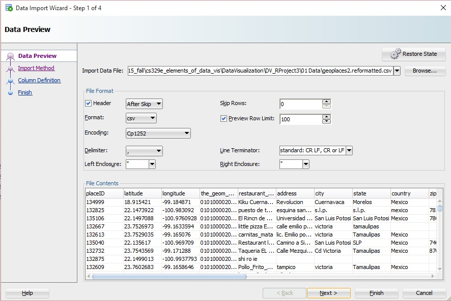
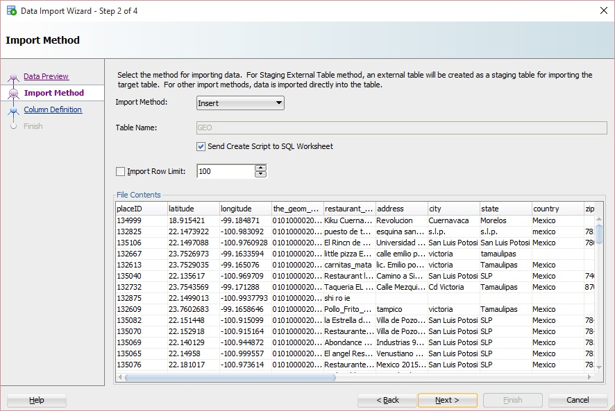
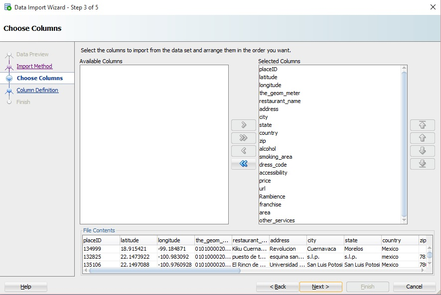
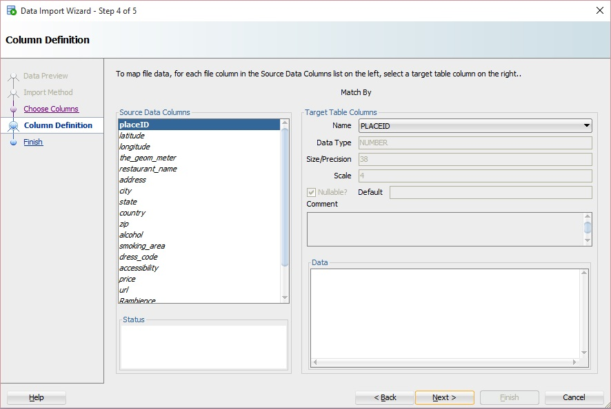

```{r message = FALSE}
require("jsonlite")
require("RCurl")
require(extrafont)
require(ggplot2)
require(tidyr)
require(dplyr)
```

## Procedure for getting our csv data onto Oracle.

#### 1. Require packages.

  

#### 2. Modify R_ETL.R: set working directory and file path, read our csv, use str() to determine which variables are continuous, and change measures accordingly. 

  

#### 3. Run the code to get the SQL CREATE TABLE command. 
  

#### 4. Use the command to create a table in SQL Developer to create a new table. 
  

#### 5. Open the table, click "Actions," and "Import Data..." 
  

#### 6. Follow through the data import wizard (Match by Position)




  

#### 7. All data from the csv file data should now be entered into the SQL table you created.

### Data Frame (GeoPlaces, Cuisine, Parking, Ratings)

```{r tidy = TRUE}
source("../01 Data/geo_etc.R", echo = TRUE)
```

## Variables
Abstract: "The dataset was obtained from a recommender system prototype. The task was to generate a top-n list of restaurants according to the consumer preferences."
All restaurants in this dataset are located in Mexico.  
state: Nominal, Missing: 18  
smoking_area: Nominal, 5 [none,only_at_bar,permitted,section,not_permitted]  
price: Nominal, 3 [medium,low,high]  
rating: Numeric, 3 [0,1,2]  
Rcuisine: Nominal, 103 [Afghan,African,American,Armenian,Asian,Australian,Austrian,Bagels,Bakery,Bar,Bar_Pub_Brewery,Barbecue,Basque,Brazilian,Breakfast-Brunch,British,Burgers,Burmese,Cafe-Coffee_Shop,Cafeteria,Cajun-  

## Data Wrangling Visualizations

#### Visualization 1
Observations: American restaurants tend to be low-medium priced, Chinese restaurants are medium-high priced, Japanese restaurants tend to be medium priced, and bars/pubs and Mexican restaurant prices range from low to high.  
```{r tidy = TRUE}
source("../03 Visualizations/visualization_1.R", echo = TRUE)
```

#### Visualization 2
Observations: Smoking in restaurants in Mexico is primarily not permitted. In Morelos, the restaurants that permit and restrict smoking are more evenly distributed. Restaurants in San Luis Potosi, generally either allow in a section or restrict smoking, as reflected by the density of the data. In Tamaulipas, restaurants either prohibit smoking or fully allow smoking; rather than having a designated section in contrast to restaurants in San Luis Potosi. There in no significant correlation between smoking, states, and rating of the establishment.
```{r tidy = TRUE}
source("../03 Visualizations/visualization_2.R", echo = TRUE)
```

#### Visualization 3
Observations: Mexican restaurants primarily do not provide parking, however some do have public parking and very few have valet parking. French restaurants in the dataset all had some form of parking. All the Chinese restaurants have no parking. American restaurants showed similar data to Mexican restaurants but with a smaller sample size. French and Dutch-Belgian restaurants are usually the ones with street parking.
```{r tidy = TRUE}
source("../03 Visualizations/visualization_3.R", echo = TRUE)
```

Citation:  
Blanca Vargas-Govea, Juan Gabriel Gonz√°lez-Serna, Rafael Ponce-Medell√???n. Effects of relevant contextual features in the performance of a restaurant recommender system. In RecSys‚???T11: Workshop on Context Aware Recommender Systems (CARS-2011), Chicago, IL, USA, October 23, 2011.
